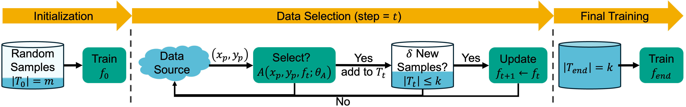

# PEAKS
ICML 2025 -- PEAKS: Selecting Key Training Examples Incrementally via Prediction Error Anchored by Kernel Similarity

> **Abstract:** *As deep learning continues to be driven by ever-larger datasets, understanding which examples are most important for generalization has become a critical question. While progress in data selection continues, emerging applications require studying this problem in dynamic contexts. To bridge this gap, we pose the Incremental Data Selection (IDS) problem, where examples arrive as a continuous stream, and need to be selected without access to the full data source. In this setting, the learner must incrementally build a training dataset of predefined size while simultaneously learning the underlying task. We find that in IDS, the impact of a new sample on the model state depends fundamentally on both its geometric relationship in the feature space and its prediction error. Leveraging this insight, we propose PEAKS (Prediction Error Anchored by Kernel Similarity), an efficient data selection method tailored for IDS. Our comprehensive evaluations demonstrate that PEAKS consistently outperforms existing selection strategies. Furthermore, PEAKS yields increasingly better performance returns than random selection as training data size grows on real-world datasets.*




# Setup
Run ```conda env create -f environment.yml -n peaks_icml2025``` to create the enviroment.

Experiment: see example_run.sh

In the paper, we present additional experiments with different architectures (ResNet-18), validation sets for improved selection, exact formulations using Jacobians (Eq. 3), and training from scratch. The entire codebase might be challenging to navigate and adapt for further research.

Therefore, we present the code for our main experiments using ViT-B/16 architecture pretrained with DINO on ImageNet-1k. If you need code for specific experiments or are curious about particular implementations (e.g., computing Eq. 3 with Jacobians), please feel free to reach out at mustafaburakgurbuz@gmail.com.
